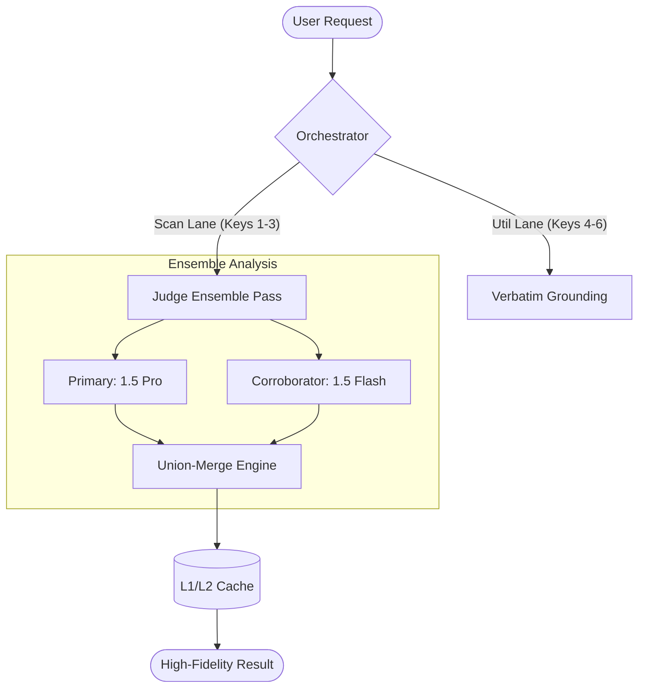

# TLDR Shield — AI Architecture & Data Science Interview Bible

> **Strategic focus:** This document covers the high-level orchestration, data engineering, and mathematical foundations of TLDR Shield. It is designed for roles combining **AI Architecture**, **Data Science**, and **System Design**.

---

## 1. Elevator Pitch (Architectural Focus)

**TLDR Shield** is an AI-driven legal intelligence engine designed to solve the "Trust Gap" in automated policy analysis. Unlike generic wrappers, it implements a **High-Availability Hybrid-Lane** architecture that orchestrates multiple LLMs (Gemini 2.5 Pro/Flash) to perform ensemble-based reasoning on dense legal texts.

**The Core Innovation:**
*   **Availability**: A 6-key priority failover pool that bypasses free-tier rate limits.
*   **Precision**: A "Judge Ensemble" pattern where parallel models reach consensus on risky clauses.
*   **Trust**: Heuristic-based "Verbatim Grounding" that aligns AI summaries with exact document citations.

---

## 2. High-Level AI Architecture

TLDR Shield follows a **Layered Intelligence** approach:

### The Hybrid-Lane System
To ensure 99.9% uptime on a zero-budget API tier, I designed a dual-lane pooling system:
*   **Lane 1 (Scan Pool)**: Optimized for latency and deep reasoning.
*   **Lane 2 (Utility Pool)**: Handles secondary tasks like grounding and citation formatting.
*   **Dynamic Borrowing**: If Lane 1 is rate-limited (429), the orchestrator dynamically borrows capacity from Lane 2.

---

## 3. Data Science & NLP Pipeline

The pipeline is a multi-stage transformation from raw legalese to structured risk tokens.

### A. Sentence-Aware Semantic Chunking
Character-based chunking is destructive to legal context. I implemented a sentence-aware chunker with a **sliding window overlap**.
*   **Logic**: Split by sentence boundaries → group into 10k character blocks → maintain 2.5k character overlap.
*   **Rationale**: Overlap is critical because legal clauses often span multiple paragraphs. Without it, the model misses context at the boundary.

### B. The Judge Ensemble (Multi-Model Consensus)
To maximize **Recall** (catching every potential risk), the system uses an ensemble of two different models.
*   **Primary (Gemini 2.5 Pro)**: High-nuance reasoning.
*   **Corroborator (Gemini 2.5 Flash)**: Keyword-sensitive safety net.
*   **The Union Merge**: If *either* model detects a violation, the system flags it. In legal tech, a **False Negative** is significantly more dangerous than a **False Positive**.

### C. Verbatim Grounding (Hallucination Mitigation)
LLMs tend to paraphrase or "hallucinate" evidence. I developed a 3-layer grounding pipeline:
1.  **Paraphrase Detection**: Regex-based filtering of third-person LLM preamble.
2.  **Fuzzy Co-location search**: An $O(n)$ search algorithm that aligns LLM keywords with exact character sequences in the source text.
3.  **Source Verification**: A final validation pass ensuring every citation exists 1:1 in the original document.

---

## 4. Mathematical Foundations

### Cosine Similarity in RAG
When performing Deep Scans, we use semantic embeddings to rank relevant document passages.
*   **Concept**: Measuring the angle between the Query Vector (Pillar Description) and the Passage Vector (Policy Snippet).
*   **Math**: $cos(\theta) = \frac{A \cdot B}{||A|| ||B||}$
*   **Why**: This allows the system to find "AI Training" clauses even if the document uses the phrase "Improve our machine learning heuristics."

### Score Calibration Algorithm
The final score (0-100) is not just LLM output. It is a **deterministic weighted sum**:
*   **Baseline**: 100.
*   **Deductions**: Each pillar violation carries a weight (e.g., AI Training = -25, Data Selling = -20).
*   **Calibration**: If the LLM returns a score that contradicts the violation count, the system overrides it to maintain mathematical consistency across the dataset.

---

## 5. System Design & Scalability

### Two-Layer Caching (L1/L2)
*   **L1 (Redis/In-memory)**: Sub-millisecond retrieval for hot URLs.
*   **L2 (Firestore)**: Global shared intelligence. If User A scans Spotify, User B gets it instantly for free.
*   **Consistency**: Cache keys are generated via `SHA256(Text + Tier + Model)`. This prevents "Cache Poisoning" if the model logic changes.

### High Availability (HA) Failover
The backend is designed for **Graceful Degradation**.
1.  **Primary**: Gemini 2.5 Pro (if enabled).
2.  **Fallback**: Gemini 2.5 Flash (Key Pool Lane 1).
3.  **Secondary Fallback**: Gemini 2.5 Flash (Key Pool Lane 2).
4.  **Deterministic Fallback**: A regex-based "Recall" pass that runs if all LLM keys are exhausted.

---

## 6. Foundational DSA in the Pipeline

| Algorithm / Concept | Implementation in TLDR Shield |
|---|---|
| **Sliding Window** | Used in text chunking and verbatim search to maintain context overlap. |
| **O(n) Linear Search** | The grounding engine performs a single pass over the document to find verbatim matches. |
| **Hash Maps (O(1))** | L1 caching and pillar lookup tables for instant retrieval. |
| **Priority Queue** | Key pool rotation logic (trying the least-recently-used key first to avoid rate limits). |
| **Graph Traversal** | Mapping dependency between different policy clauses. |

---

## 7. Evaluation & Metrics

How do we know it works?
*   **Golden Dataset**: A hand-curated set of 30 policies with "Ground Truth" labels.
*   **Accuracy Metrics**: We measure **Pillar Accuracy** (binary) and **Score Variance** (Mean Absolute Error).
*   **Regression Detection**: Every major architectural change (like switching to Gemini 2.5) is run against the eval suite. A drop of >5% in Pillar Accuracy blocks the deployment.

---

## 8. High-Level Q&A for Interviews

### Q1: Why not just use one large context window (1M tokens)?
**A**: While Gemini supports 1M+ tokens, processing a 50k-word policy in one shot is expensive and increases the "Lost in the Middle" phenomenon. Chunking allows for **parallel processing**, reducing latency from 45s to 15s.

### Q2: How do you handle LLM hallucinations in legal citations?
**A**: We use a **Grounding Pass**. The LLM is forced to return a citation. We then use a fuzzy string matcher to find that text in the source. If it's a paraphrase, we replace it with the exact verbatim quote. If it doesn't exist, we drop the violation.

### Q3: Explain the "Hybrid Lane" architecture.
**A**: It's a resource isolation pattern. By splitting keys into "Scan" and "Utility" pools, we ensure that a heavy background task (like re-checking 100 watched URLs) doesn't block a real-time user request. It's a software implementation of **Rate Limit Partitioning**.

### Q4: What is the trade-off between Recall and Precision in this project?
**A**: We prioritize **Recall**. In privacy protection, missing one "Data Selling" clause is a failure. We use an **Ensemble Union Merge** to ensure that if any model is suspicious, we alert the user. We then use **Grounding** to ensure the Precision remains high by verifying the evidence.
