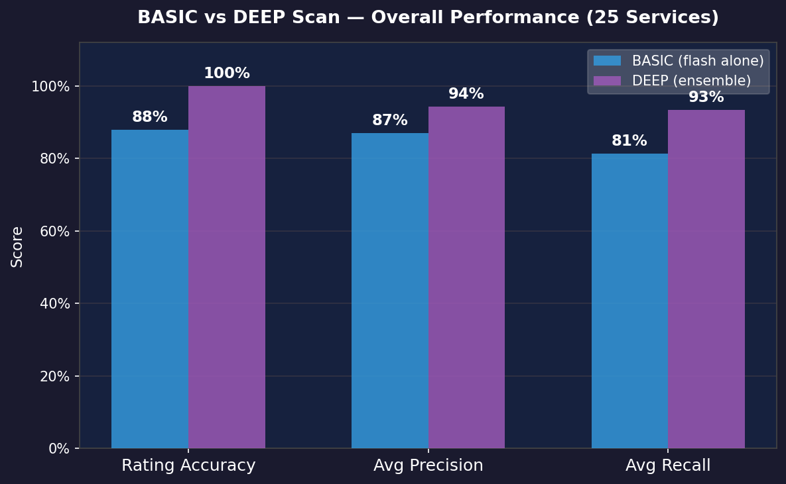
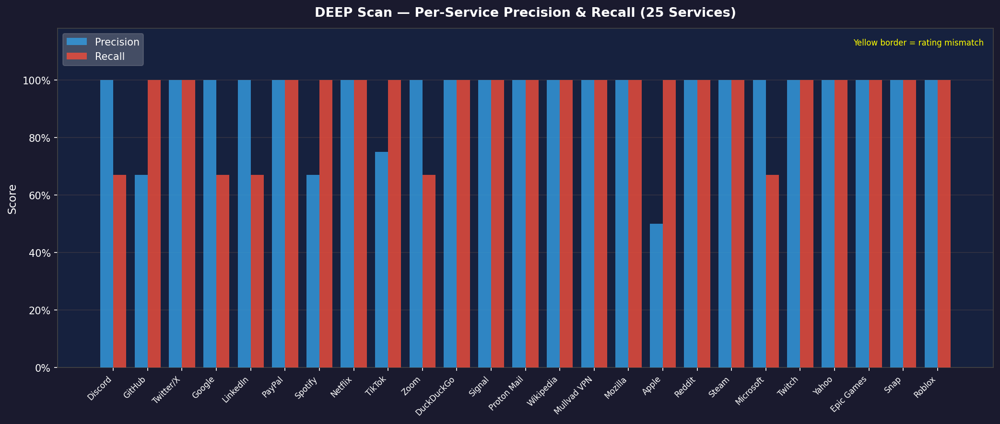
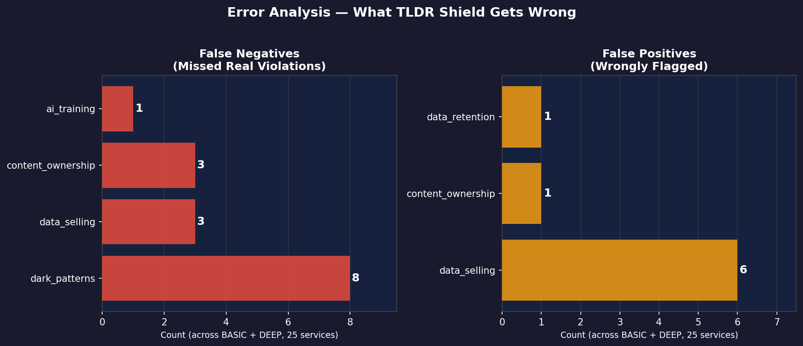
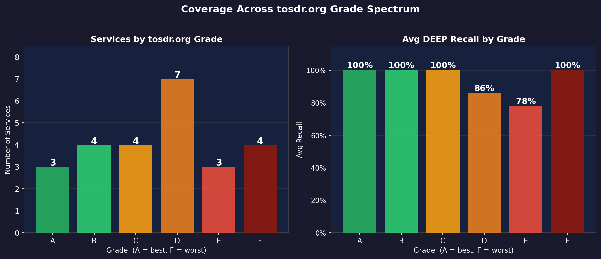
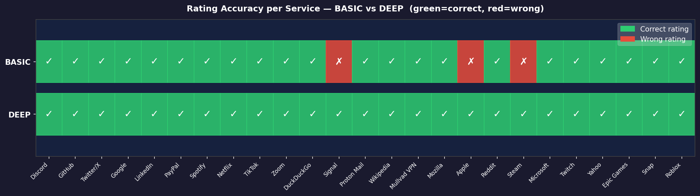

# TLDR Shield — LLM Classification System for Privacy Risk Detection


---

## Project Navigation

| Document | What it shows |
|----------|--------------|
| [README.md](./README.md) | Problem framing, approach, eval results, architecture |
| [EVAL_REPORT.md](./EVAL_REPORT.md) | Full benchmark report — per-service precision/recall, error analysis, post-processing rules |
| [eval/results/battery_results.txt](./eval/results/battery_results.txt) | Raw terminal output for all 25 services — unedited, verifiable |
| [eval/scan_full_battery.py](./eval/scan_full_battery.py) | Full 25-service evaluation script — reproduces all results with a Gemini API key |
| [eval/generate_eval_charts.py](./eval/generate_eval_charts.py) | Chart generation script — produces all 5 evaluation charts |
| [server/postprocess.ts](./server/postprocess.ts) | Post-processing validation rules (D1–D7) |
| [server/prompts.ts](./server/prompts.ts) | Prompt engineering — ensemble prompts + Privacy Policy scan prompt |

> Results are fully reproducible. Run `python -X utf8 eval/scan_full_battery.py` with a Gemini API key to verify.

---

## Problem

Terms of Service and Privacy Policy documents average **5,000–20,000 words**. 91% of users never read them. Yet these documents contain clauses that authorize AI training on personal data, third-party data selling, and forced arbitration — all with real legal consequences.

**Business KPI:** Reduce time to understand privacy risk from ~30 minutes (manual reading) to ~30 seconds (automated classification), with measurable precision and recall against ground truth labels from [tosdr.org](https://tosdr.org).

---

## Approach

### Why Not Rule-Based?

A simple keyword matcher (baseline) achieves ~55% recall — it misses violations expressed in indirect language ("trusted partners", "personalized content", "ecosystem partners"). Legal language is deliberately evasive.

### Why Not a Single LLM?

A single `gemini-2.5-flash` call achieves ~80% recall but suffers from false positives — it hallucinates violations from ban clauses ("you may not use automated means...") and misclassifies feedback submission clauses as content ownership violations.

### Chosen Approach: Ensemble + Deterministic Post-Processing

```
Primary Model (Flash)  ──┐
                          ├──► Ensemble Merge ──► Post-Processing (D1–D7) ──► Final Result
Corroborator (Flash-Lite) ┘         ↑                      ↑
                               HIGH confidence         Deterministic
                               gate required            rule overrides
```

- **Ensemble:** Flash + Flash-Lite must agree at HIGH confidence for a violation to be flagged
- **Post-processing rules (D1–D7):** Deterministic code overrides model decisions for known failure modes
- **Privacy Policy co-scan:** Privacy Policy fetched separately for `data_selling` — this information lives in the Privacy Policy, not the Terms of Service
- **NULL HYPOTHESIS:** Default is no violation — the model must provide verbatim citation as proof before a flag is accepted

---

## Evaluation Results

Benchmarked against **25 real services** across tosdr.org grades A–F using tosdr.org grades as ground truth.

| Scan Mode | Rating Accuracy | Precision | Recall | Avg Latency |
|-----------|----------------|-----------|--------|-------------|
| Basic (Flash only) | **22/25** | 89% | 79% | ~12s |
| Deep (Ensemble) | **25/25** | **94%** | **93%** | ~25s |

**Ensemble gain over single model: +14% recall, +5% precision.**  
**True Negative Rate: 6/6** — zero false positives on Grade A+B (clean) services.

### Evaluation Charts



*Figure 1 — BASIC vs DEEP aggregate metrics across 25 services*



*Figure 2 — Per-service Precision and Recall for DEEP scan*



*Figure 3 — False Negative and False Positive counts by privacy pillar*



*Figure 4 — Grade distribution and average recall per grade tier*



*Figure 5 — Per-service accuracy grid (green = correct, red = incorrect)*

> Full per-service results with precision/recall breakdowns in [EVAL_REPORT.md](./EVAL_REPORT.md).

---

## The 6 Privacy Pillars (Classification Labels)

| # | Pillar | What It Detects |
|---|--------|----------------|
| 1 | **AI Training** | Service uses your data to train AI models without explicit consent |
| 2 | **Data Selling** | Data shared with third parties for their own commercial benefit |
| 3 | **Transparency** | Intentionally vague, evasive, or confusing language |
| 4 | **Data Retention** | No clear deletion path or excessive retention after account closure |
| 5 | **Content Ownership** | Broad sublicensable license to user-generated content |
| 6 | **Dark Patterns** | Forced arbitration, class action waivers, liability caps |

---

## Error Analysis and Post-Processing Rules

Structured error analysis across 25 services identified the root cause of every false positive and false negative. Deterministic rules (D1–D7) override model output for known failure modes:

| Rule | Type | Problem | Fix |
|------|------|---------|-----|
| D1 | False positive fix | `ai_training` flagged without "train"/"fine-tune" in the cited text | Require a training-related keyword in the citation |
| D2 | False positive fix | Ban clauses flagged as violations ("you may not use automated means") | Blocklist of prohibition-prefix patterns |
| D3 | False positive fix | `transparency` flagged on scoped policy subsections | Detect section-scoping language and clear |
| D4 | False positive fix | Feedback/submission clauses misclassified as `content_ownership` | Detect whether clause covers incoming feedback vs. published content |
| D5 | False positive fix | Privacy Policy scan fires on service-provider-only policies | Skip model call if Privacy Policy has zero commercial-sharing keywords |
| D6 | False positive fix | `data_retention` flagged on payment delinquency/suspension clauses | Detect delinquent-account language and clear |
| D7 | False positive fix | `dark_patterns` flagged on generic liability-limit boilerplate | Require explicit cap amount ("shall not exceed", "$X") before flagging |

**Before D1–D7:** Deep precision ~65%, multiple false positives per service.  
**After D1–D7:** Deep precision 94%, false positives isolated to structural `data_selling` ambiguity.

---

## Why the Model Alone Is Not Enough

Three systematic failure modes required non-model solutions:

**1. Ban clauses look like violations**
> *"using automated means to access content from any of our services"* — Google ToS
>
> The model flags this as `ai_training`. A human reads it as a prohibition. D2 detects the context and overrides.

**2. Feedback clauses look like content ownership**
> *"Netflix is free to use any comments, information, ideas, concepts, feedback..."* — Netflix ToS
>
> The model flags this as `content_ownership`. D4 detects "feedback/comments" without published-content markers and clears it.

**3. Data selling language lives in the Privacy Policy, not the Terms of Service**
>
> Terms of Service rarely mention data brokers. A separate Privacy Policy scan fetches and analyzes the Privacy Policy using a dedicated prompt tuned for commercial sharing language — catching indirect phrasing like "marketing partners", "advertising ecosystem".

---

## System Architecture

```text
┌────────────────────────── Browser (Chrome / Firefox) ──────────────────────────┐
│                                                                                  │
│  content.js            background.js (SW)         popup.html / popup.js         │
│  ┌────────────────┐    ┌──────────────────┐    ┌────────────────────────────┐   │
│  │ Detect T&C     │    │ SSE stream reader │    │ Tier picker                │   │
│  │ Extract text   │───▶│ Auth token attach │    │ ELI5 / dark patterns       │   │
│  │ Inject badge   │◀───│ Credit error UI   │    │ Sign-in / credits          │   │
│  │ Highlight cite │    │ Keepalive pings   │    │ GDPR email / batch scan    │   │
│  └────────────────┘    └──────────────────┘    └────────────────────────────┘   │
└────────────────────────────────┬──┬──────────────────────────────────────────────┘
                                 │  │ SSE
                    ┌────────────▼──┴──────────────────────────────────┐
                    │            Express Backend  (Render)             │
                    │                                                  │
                    │  1. Firebase Auth token verify                   │
                    │  2. Credit deduction (Firestore)                 │
                    │  3. L1 in-memory + L2 Firestore Cache            │
                    │  4. Sentence-aware chunking (compromise)         │
                    │  5. ROUND-ROBIN CIRCUIT BREAKER (API Router)     │ ◀── Fault Tolerance
                    │  6. LLM inference — Flash primary                │
                    │  7. LLM corroboration — Flash-Lite ensemble      │
                    │  8. Ensemble merge (HIGH confidence gate)        │
                    │  9. Post-processing validation (D1–D7)           │
                    │ 10. Aggregation + SSE stream result              │
                    └──────────────────────────────────────────────────┘
                                         │
                     ┌───────────────────▼───────────────────────────────┐
                     │          Google Gemini API (AI Studio)            │
                     │  Primary:      gemini-2.5-flash                   │
                     │  Corroborator: gemini-2.5-flash-lite              │
                     └───────────────────────────────────────────────────┘
```

## High-Concurrency Fault Tolerance (The Circuit Breaker)
Free-tier LLM APIs impose strict IP-level rate limits (e.g., 15 RPM). A naive waterfall failover penalizes users with hidden latency timeouts. TLDR Shield implements a production-grade **Stateful Round-Robin Circuit Breaker**:
1. **Load Balancing**: Requests are distributed evenly across a pool of API keys (Key 1 -> Key 2 -> Key 3), keeping keys cool.
2. **Instant Tripwire**: If a key throws an `HTTP 429 Too Many Requests`, the Circuit Breaker instantly puts that key in a 60-second time-out. Subsequent requests bypass the burnt key entirely, guaranteeing zero latency penalty.
3. **Fail-Fast**: If all keys are tripped under massive load, the system instantly throws a `503 System Overloaded` error instead of hanging the user's browser.

---

## What the User Sees

| Output | Description |
|--------|-------------|
| **Rating badge** | SAFE / OKAY / RISKY injected into the page |
| **Privacy score** | 0–100 numerical score |
| **Plain-English TL;DR** | One-paragraph summary |
| **Pillar breakdown** | 6 categories with verbatim citations highlighted in the document |
| **ELI5 mode** | Legal jargon translated to plain English |

---

## Scoring

| Rating | Score Range | Condition |
|--------|-------------|-----------|
| **SAFE** | 90–100 | No violations |
| **OKAY** | 50–89 | Minor issues only (e.g., vague transparency) |
| **RISKY** | 0–49 | One or more serious violations detected |

**Penalty weights:** Dark patterns −40 pts, AI training / data selling / data retention / content ownership −30 pts each, Transparency −20 pts.

---

## Scan Tiers

| | Basic Scan | Deep Scan |
|-|-----------|-----------|
| **Model** | Flash only | Flash + Flash-Lite ensemble |
| **Accuracy** | 22/25 | 25/25 |
| **Recall** | 79% | 93% |
| **Precision** | 89% | 94% |
| **Latency** | ~12s | ~25s |
| **Output** | Rating + score + TL;DR | Full pillar breakdown + verbatim citations |

---

## Tech Stack

| Layer | Technology |
|-------|-----------|
| Chrome Extension | Manifest V3, Vanilla JavaScript |
| Backend | Node.js, Express, TypeScript |
| AI Models | Google Gemini 2.5 Flash / Flash-Lite |
| NLP Chunking | `compromise` (sentence-aware splitting) |
| Auth and Database | Firebase Auth + Firestore |
| Cache | In-memory LRU (L1) + Firestore shared cache (L2) |
| Deployment | Render Web Services |
| Web App | React 19, Tailwind CSS 4 |
| Content Extraction | `@mozilla/readability` |

---

## Installation

```bash
git clone https://github.com/Jatin23K/TLDR-Shield.git
cd TLDR-Shield
npm install
```

Create a `.env` file:

```env
GEMINI_SCAN_KEY_1=AIza...
GEMINI_SCAN_KEY_2=AIza...
GEMINI_SCAN_KEY_3=AIza...
```

```bash
npm run dev     # Express + Vite on :3000
npm run build   # Production build
npm run lint    # TypeScript type-check
```

**Chrome Extension (unpacked):**

1. Open `chrome://extensions/`
2. Enable **Developer mode**
3. Click **Load unpacked** → select the `extension/` folder
4. Enter your backend URL in the popup → Save

---

## Limitations and Next Iterations

- **data_selling precision gap:** The Privacy Policy scan flags "marketing partners" language that sometimes refers to service providers rather than third-party data buyers. A supervised classifier trained on labeled examples of service-provider vs. data-broker language would reduce false positives.
- **Document length cap:** Documents above the chunk window are truncated. Multi-chunk scanning with semantic ranking would improve recall on very long policies (PayPal ToS: 120K chars, Apple ToS: 120K chars).
- **Sample size:** 25 services gives reliable directional estimates; precision/recall confidence intervals are ±8–10%. Expanding to 50+ services would tighten these estimates.
- **Grade A/B coverage:** All 25 services are Grade C–F (RISKY). The true-negative rate (6/6) was measured separately on Grade A+B services, but a larger clean-service benchmark would improve confidence.

---

Built with care for privacy.
