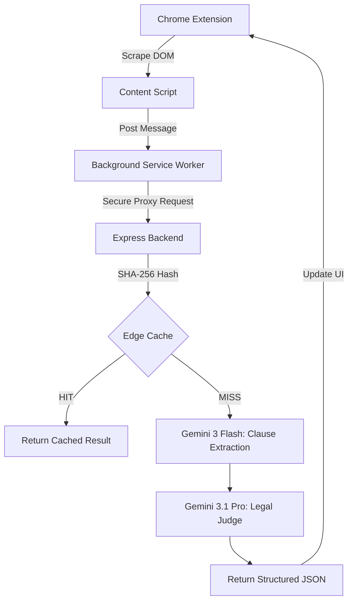

# 🛡️ TL;DR Shield X2.0

**Stop blindly clicking "I Agree."** TL;DR Shield is a world-class, privacy-focused Chrome Extension that uses advanced Large Language Models (LLMs) to scan and score Terms of Service (ToS) and Privacy Policies in seconds.


## 🚀 Key Features (X2.0)

- **Multi-Model Judge Pattern:** 
  - **Phase 1 (Speed):** Gemini 3 Flash extracts relevant legal clauses in milliseconds.
  - **Phase 2 (Accuracy):** Gemini 3.1 Pro performs deep semantic reasoning to judge those clauses.
- **6 Privacy Pillars:** Analysis across AI Training, Data Selling, Transparency, Retention, Ownership, and **Dark Pattern Detection**.
- **ELI5 Mode (Explain Like I'm 5):** Toggle to translate complex legal jargon into simple, conversational English.
- **In-Page Trust Seal:** A floating badge injected into every website that glows **Green (Safe)**, **Yellow (Okay)**, or **Red (Risky)** based on the site's privacy score.
- **Edge Caching:** SHA-256 hash-based in-memory caching on the server to prevent redundant LLM calls and reduce latency.
- **Chrome Side Panel Support:** Persistent analysis sidebar that stays open as you navigate the web.
- **Theme Toggle:** Global Dark/Light mode support for both the extension and the landing page.
- **Automatic URL Discovery:** Automatically hunts for "Privacy" or "Terms" links on any landing page.

## 🏗️ Technical Architecture



## 🛠️ Tech Stack

- **Frontend:** React 19, Tailwind CSS 4, Framer Motion (motion/react), Lucide Icons.
- **Extension:** Manifest V3, Vanilla JavaScript, Tailwind CSS (via CDN).
- **Backend:** Node.js, Express, Vite (Middleware Mode), Google GenAI SDK.
- **AI Models:** Gemini 3 Flash (Extraction), Gemini 3.1 Pro (Reasoning).

## 📦 Installation

### 1. Backend Setup
1. Clone the repository.
2. Install dependencies:
   ```bash
   npm install
   ```
3. Set your environment variables in `.env`:
   ```env
   GEMINI_API_KEY="your_api_key_here"
   ```
4. Start the full-stack server:
   ```bash
   npm run dev
   ```

### 2. Extension Setup
1. Open Chrome and navigate to `chrome://extensions/`.
2. Enable **Developer mode** (top right).
3. Click **Load unpacked**.
4. Select the `/extension` folder from this project.
5. **Configuration:** Open the extension popup, right-click to inspect, and set the `backendUrl` in `chrome.storage.local` to your hosted backend URL.

## ⚖️ The 6 Privacy Pillars

1. **AI Training Opt-Out:** Does the service use your data to train AI models without consent?
2. **Third-Party Monetization:** Is your data sold to brokers or shared for marketing?
3. **Vague Transparency:** Is the language intentionally evasive or confusing?
4. **Data Retention & Exit:** Can you permanently delete your data?
5. **Content Ownership:** Do you surrender copyright to your uploaded content?
6. **Dark Patterns:** Does the text use manipulative language to hide traps?

## 🚦 Scoring Logic

- **SAFE (Green):** 0 major violations across all pillars.
- **OKAY (Yellow):** 0 major violations, but ambiguous language detected in Pillar 3 (Transparency).
- **RISKY (Red):** 1 or more major violations detected.

## 🔮 Future Roadmap

- [ ] **WASM Local Inference:** Run tiny models (Gemma 2B) locally in the browser for 100% private "Quick Scans".
- [ ] **One-Click Opt-Out:** Automatically generate GDPR "Right to Object" emails.
- [ ] **Privacy Benchmarking:** Compare a site's score against industry averages.

---

Built with ❤️ for privacy by the **TL;DR Shield Team**.
