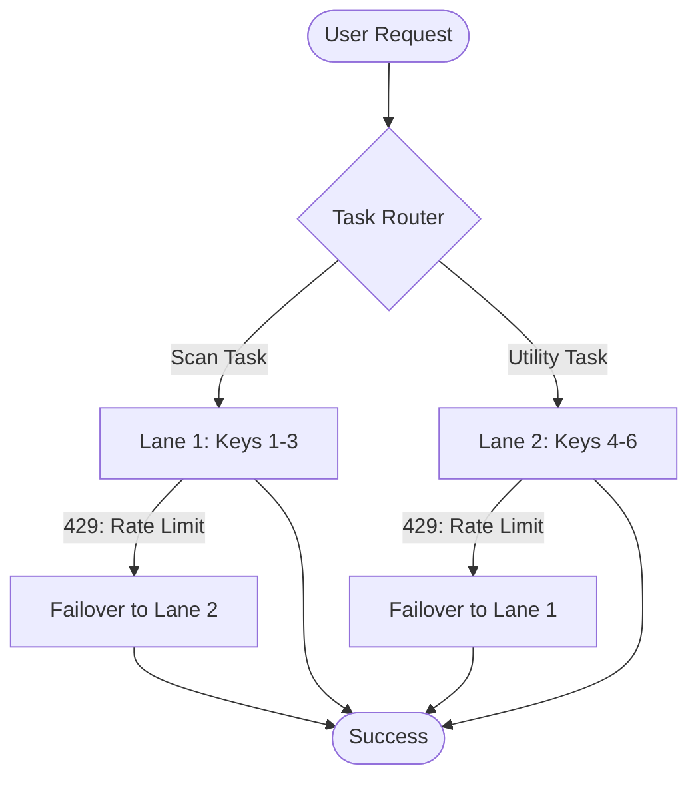
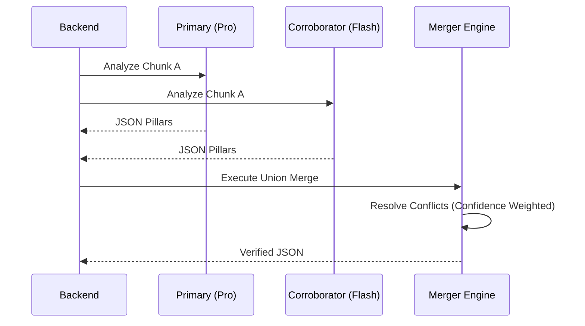

# TLDR Shield: System Design & Technical Architecture

TLDR Shield is not just a "GPT Wrapper." It is a multi-layered analysis engine designed to solve the three core problems of AI-driven legal analysis: **hallucinations, rate-limiting, and cost.**

---

## 1. The Hybrid-Lane High-Availability Pool
To bypass the strict rate limits of free LLM tiers (e.g., 15 RPM for Gemini Flash), TLDR Shield implements a **Distributed Key Pool** with logical lane prioritization.

### Key Rotation Strategy
The system maintains a pool of 6 API keys (3 for scanning, 3 for utilities). At runtime, these are merged into a prioritized "Hybrid Pool."

**Technical Rationale:** This allows for 100% capacity utilization. If Lane 1 is busy, the system "borrows" capacity from Lane 2 instead of failing.

---

## 2. The Judge Ensemble Pattern
Legal documents are high-stakes. A single LLM pass can miss subtle "poison clauses." TLDR Shield uses an **Ensemble Judge** architecture for Deep Scans.

*   **Primary Model**: Focuses on reasoning and nuance.
*   **Corroborator Model**: Acts as a "Safety Net" to catch specific keywords (e.g., "arbitration," "AI training") the primary might overlook.
*   **The Merger**: Performs a **Union Merge**. If *either* model detects a violation, it is kept. This maximizes **Recall** (catching every risk).

---

## 3. High-Fidelity Post-Processing Pipeline
Raw LLM output is untrustworthy. Every response passes through a 3-stage validation pipeline:

### Phase 1: Verbatim Grounding (Heuristic)
The LLM often paraphrases citations. Our `findVerbatimInChunk` algorithm takes the LLM's citation and performs a **fuzzy keyword co-location search** in the original source text to find the *exact* character-for-character sequence.

### Phase 2: Consistency Cross-Check
The system compares the **Rating (Safe/Risky)** against the **Score (0-100)** and individual **Pillar Violations**. 
*   *Conflict*: If Rating is "SAFE" but a "HIGH" violation is found, the system triggers an automatic internal retry with a higher temperature or different model.

### Phase 3: Sanitization
Strips hallucinated preamble text and ensures the final response is a strictly compliant JSON schema.

---

## 4. Multi-Layer Caching Strategy
To ensure sub-millisecond responsiveness for popular sites (Google, Facebook, Spotify), we use a dual-cache approach:

1.  **L1 Cache (Upstash Redis)**: Keyed by `sha256(URL)`. Holds the full analyzed object for 24 hours.
2.  **L2 Cache (Cloud Firestore)**: Persistent global intelligence. Results from all users are aggregated to build a "Global Risk Map."

---

## 5. Security & Privacy
*   **Zero-Knowledge Collection**: We do not store User IDs alongside the text analyzed in the L2 cache.
*   **JWT-Metered Access**: All API calls are authenticated via Firebase Auth, with credits strictly metered via Firestore transactions to prevent API abuse.
